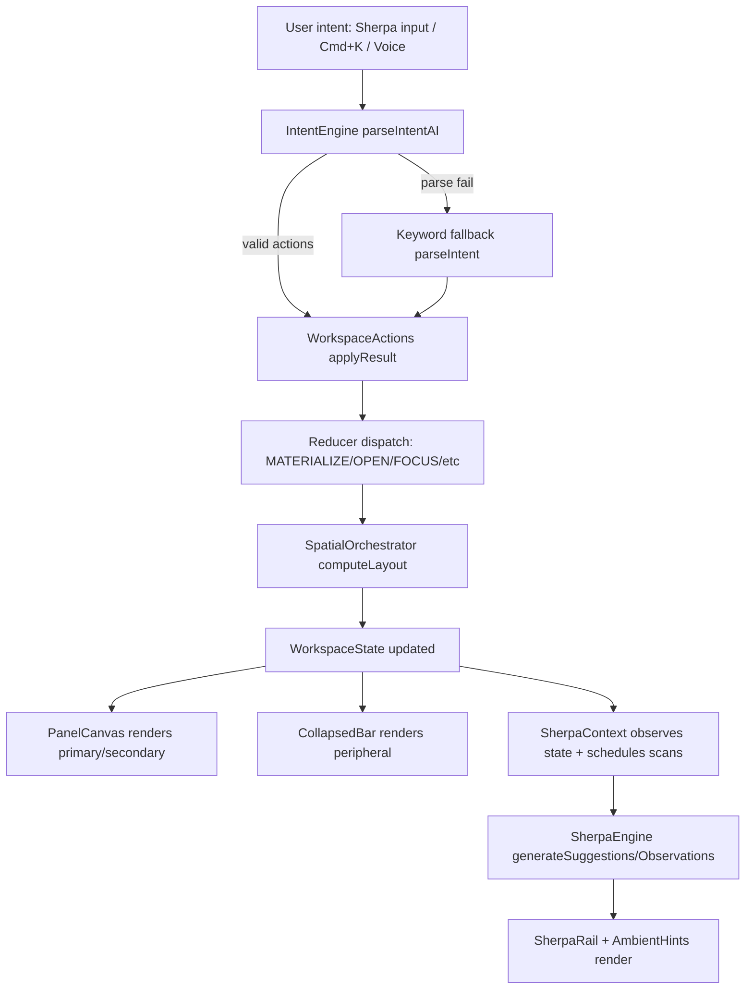

# Pre-Handoff Code Audit and Claude Code Handoff Plan for `rmead777/dream-state-canvas`

## Executive summary

This repository is already **well on the “cognitive workspace” track**: you have a typed workspace object ontology, an AI-backed intent engine with deterministic fallbacks, a Sherpa layer split into engine/context/UI, an immersive depth overlay for document/dataset deep work, and a fusion mechanic with provenance captured in output context. fileciteturn11file0L1-L1 fileciteturn10file0L1-L1 fileciteturn12file0L1-L1 fileciteturn34file0L1-L1 fileciteturn22file0L1-L1  
The **highest pre-handoff risks** are (a) **security/compliance**: a committed `.env` and a large “real” AP dataset with vendor contact details in a public repo, (b) **orchestration correctness**: the spatial layout function can silently “drop” open objects from rendering when over capacity, and (c) **ontology drift in code**: `origin.type` uses an untyped `"fusion" as any` in multiple places, plus duplicated layout sources of truth (`object.position` vs `spatialLayout`). fileciteturn46file0L1-L1 fileciteturn41file0L1-L1 fileciteturn13file0L1-L1 fileciteturn23file0L1-L1 fileciteturn11file0L1-L1  
The actionable handoff plan below starts by eliminating repo-level risk (secrets/PII), then hardens the workspace lifecycle guarantees (no “lost” objects, deterministic layout rules), and finally adds governance/validation (Zod schemas + tests) so Claude Code agents can iterate safely. fileciteturn43file0L1-L1

**Pre-handoff acceptance checklist**

- `.env` removed from git history (or repo), `.gitignore` updated to ignore env files, and Supabase keys reviewed/rotated as appropriate. fileciteturn46file0L1-L1 fileciteturn47file0L1-L1  
- “Real” seed dataset sanitized/replaced with synthetic fixtures (no emails, phone numbers, real vendor names) or moved to a private store behind auth. fileciteturn41file0L1-L1  
- Spatial orchestration guarantees: **no open object can become unreachable** (either visible, receded with an affordance, or explicitly collapsed). fileciteturn13file0L1-L1 fileciteturn17file0L1-L1  
- `IntentOriginType` and all producers of `origin.type` are consistent (no `as any` escape hatches). fileciteturn11file0L1-L1 fileciteturn23file0L1-L1 fileciteturn28file0L1-L1  
- Add baseline unit tests (Vitest) for `computeLayout`, intent parsing fallback, and fuse governance; `npm test` passes in CI. fileciteturn43file0L1-L1  

## Repository scope and files reviewed

You requested a deep audit of these files (and I was able to retrieve all of them from this repo). Paths read exactly as listed:

- `src/lib/workspace-types.ts` fileciteturn11file0L1-L1  
- `src/lib/intent-engine.ts` fileciteturn10file0L1-L1  
- `src/lib/sherpa-engine.ts` fileciteturn12file0L1-L1  
- `src/lib/spatial-orchestrator.ts` fileciteturn13file0L1-L1  
- `src/contexts/WorkspaceContext.tsx` fileciteturn14file0L1-L1  
- `src/contexts/SherpaContext.tsx` fileciteturn15file0L1-L1  
- `src/components/workspace/WorkspaceShell.tsx` fileciteturn16file0L1-L1  
- `src/components/workspace/PanelCanvas.tsx` fileciteturn17file0L1-L1  
- `src/components/workspace/WorkspaceObject.tsx` fileciteturn18file0L1-L1  
- `src/components/workspace/SherpaRail.tsx` fileciteturn19file0L1-L1  
- `src/pages/Index.tsx` fileciteturn20file0L1-L1  

Additional repo files were reviewed to satisfy your fusion, lifecycle, security, and AI integration deliverables, including: `fusion-rules.ts`, `fusion-executor.ts`, `useWorkspaceActions.ts`, `useAI.ts`, `seed-data.ts`, `document-store.ts`, `.env`, `.gitignore`, and more. fileciteturn21file0L1-L1 fileciteturn22file0L1-L1 fileciteturn23file0L1-L1 fileciteturn37file0L1-L1 fileciteturn41file0L1-L1 fileciteturn42file0L1-L1 fileciteturn46file0L1-L1 fileciteturn47file0L1-L1  

### File-to-responsibility audit table

| File | Primary responsibility | Key exports / entry points | Immediate issues / smells (one line) | Suggested quick fix (one line) |
|---|---|---|---|---|
| `src/lib/workspace-types.ts` fileciteturn11file0L1-L1 | Canonical ontology + reducer action typing | `WorkspaceObject`, `WorkspaceState`, `WorkspaceReducerAction`, intent/sherpa types | Missing `priority/persistence` metadata; `relationships` is untyped `string[]`; layout has dual sources (`position` + `spatialLayout`) | Add `priority` + `persistence` fields; introduce relationship edges or metadata; deprecate/unify `position` |
| `src/lib/intent-engine.ts` fileciteturn10file0L1-L1 | Intent parsing (LLM + keyword fallback) + dynamic data construction | `parseIntentAI`, `parseIntent`, `refineDataRules`, `invalidateProfileCache` | JSON extraction is brittle; no runtime schema validation; potential invalid `objectType` passthrough | Add Zod validation + strict enum guards; clamp actions count; improve JSON extraction |
| `src/lib/sherpa-engine.ts` fileciteturn12file0L1-L1 | Suggestion + observation generation (pure) | `generateSuggestions`, `generateObservations` | “Frequent interaction” heuristic is weak; no permissions layer; relies on global dataset/profile side effects | Return structured `SherpaSuggestionAction[]`; add policy-gated execution in a lifecycle module |
| `src/lib/spatial-orchestrator.ts` fileciteturn13file0L1-L1 | Layout computation for zones | `computeLayout`, `placeNewObject`, `getObjectToShift` | Can produce “unrendered but open” objects (IDs not in any zone); `placeNewObject/getObjectToShift` unused | Ensure overflow objects become `collapsed` (or “receded” list) deterministically; add tests |
| `src/contexts/WorkspaceContext.tsx` fileciteturn14file0L1-L1 | Workspace store + reducer | `WorkspaceProvider`, `useWorkspace` | `UNPIN_OBJECT` doesn’t recompute layout; layout recompute can fight manual reorder; timestamps lost on restore | Recompute on unpin; add stable ordering tie-break; store/restore timestamps optionally |
| `src/contexts/SherpaContext.tsx` fileciteturn15file0L1-L1 | Reactive Sherpa layer (watches workspace) | `SherpaProvider`, `useSherpa` | Runs periodic scans + dispatches directly; suggestions keyed only on object count; can drift from actual state changes | Key effects on `state.objects` hash; move “actions” to lifecycle engine with permission gates |
| `src/components/workspace/WorkspaceShell.tsx` fileciteturn16file0L1-L1 | App shell orchestration | `WorkspaceShell` | Lifecycle/behavior spread across hooks; no single “workspace loop” | Introduce `useWorkspaceLifecycle()` to centralize scheduling + policy decisions |
| `src/components/workspace/PanelCanvas.tsx` fileciteturn17file0L1-L1 | Auto layout rendering + DnD reorder + fusion trigger | `PanelCanvas` | Fusion trigger shares gesture with reorder; over-capacity hides objects (due to layout), not “recede” | Require explicit “fusion modifier” or bigger threshold; show overflow affordance |
| `src/components/workspace/WorkspaceObject.tsx` fileciteturn18file0L1-L1 | Object wrapper chrome + resize + contextual actions | `WorkspaceObjectWrapper` | Resizing persists only in component state; diagonal resize can break auto layout; “monitor” hint has no action | Persist size into object context or omit; restrict width resize in auto layout; implement monitor action or remove hint |
| `src/components/workspace/SherpaRail.tsx` fileciteturn19file0L1-L1 | Sherpa UI rail (input/suggestions/docs/admin) | `SherpaRail` | Very feature-dense; client-side “admin passphrase” is theatre; edge function auth uses anon key | Gate admin/dev controls behind build flag; use session token for edge calls |
| `src/pages/Index.tsx` fileciteturn20file0L1-L1 | Provider composition | default export | Provider order is OK but no error boundaries | Add error boundary + suspense where needed |

## Workspace ontology and state management audit

### WorkspaceObject fields implemented vs planned model

**Current `WorkspaceObject` implementation** includes:  
`id`, `type`, `title`, `status`, `pinned`, `origin`, `relationships: string[]`, `context`, `position`, optional `freeformPosition`, `createdAt`, `lastInteractedAt`. fileciteturn11file0L1-L1  

**Planned model fields you explicitly called out** (intent/provenance, relationships, persistence, priority, state) map as follows:

- **State**: implemented as `status: 'materializing' | 'open' | 'collapsed' | 'dissolved'` (good). fileciteturn11file0L1-L1  
- **Intent origin**: implemented as `origin: IntentOrigin` (good), but there’s drift in usage: multiple call sites set `origin.type = 'fusion' as any` which violates the union. fileciteturn11file0L1-L1 fileciteturn23file0L1-L1 fileciteturn28file0L1-L1  
- **Relationships**: implemented only as `string[]` without direction/semantics (limits cross-object intelligence and cascade safety). fileciteturn11file0L1-L1  
- **Persistence**: not represented as a first-class field; persistence is implicit in `useWorkspacePersistence()` which serializes all objects (including potentially huge contexts) into `localStorage`. fileciteturn25file0L1-L1  
- **Priority**: not represented; “priority” is simulated via `pinned` and recency sorting, plus breathing auto-collapse. fileciteturn13file0L1-L1 fileciteturn24file0L1-L1  

### Exact TypeScript changes recommended

The goal is to (1) remove ontology escape hatches, (2) make lifecycle decisions explicit, and (3) prevent double sources of truth for layout.

**Proposed type additions (minimal but high leverage)**

- Add `priority: number` (0–100) with default computed per object type + origin.
- Add `persistence` metadata to control what is serialized and how aggressively objects are auto-collapsed/dissolved.
- Fix `IntentOriginType` to include either an explicit `fusion` type or enforce “fusion is cross-object”.

#### Suggested patch (TypeScript diff)

```diff
diff --git a/src/lib/workspace-types.ts b/src/lib/workspace-types.ts
--- a/src/lib/workspace-types.ts
+++ b/src/lib/workspace-types.ts
@@
-export type IntentOriginType = 'user-query' | 'sherpa-suggestion' | 'cross-object' | 'system';
+export type IntentOriginType =
+  | 'user-query'
+  | 'sherpa-suggestion'
+  | 'cross-object'
+  | 'system';
+  // NOTE: do NOT add 'fusion' if you can represent fusion as 'cross-object' with sourceObjectId.

@@
 export interface WorkspaceObject {
   id: string;
   type: ObjectType;
   title: string;
   status: ObjectStatus;
   pinned: boolean;
   origin: IntentOrigin;
-  relationships: string[];
+  relationships: string[]; // v1 (ids). Consider migrating to edges later.
   context: Record<string, any>;
-  position: SpatialPosition;
+  // position is currently unused as a source of truth; spatialLayout is authoritative.
+  // Keep temporarily for backwards-compat + persistence, but mark as deprecated.
+  position: SpatialPosition;
   freeformPosition?: FreeformPosition;
+  /** Lifecycle priority: 0–100. Drives layout ordering, breathing, persistence. */
+  priority: number;
+  /** Persistence and lifecycle governance controls */
+  persistence: {
+    /** If false, do not write to localStorage (ephemeral objects) */
+    restorable: boolean;
+    /** Prefer to keep when trimming workspace surface area */
+    keepAlive: boolean;
+    /** Auto-collapse after this inactivity window (ms), if not pinned */
+    autoCollapseAfterMs?: number;
+  };
   createdAt: number;
   lastInteractedAt: number;
 }
```

This patch is consistent with your “persistence + priority” asks while keeping the current `relationships: string[]` to avoid a large refactor on day one. fileciteturn11file0L1-L1  

### Migration steps

1. **Fix origin typing immediately** by removing all `"fusion" as any` occurrences and using `{ type: 'cross-object', sourceObjectId: <id>, query: ... }`. The offenders are `useWorkspaceActions.ts` and `FreeformCanvas.tsx`. fileciteturn23file0L1-L1 fileciteturn28file0L1-L1  
2. Update all `MATERIALIZE_OBJECT` payload builders to include default `priority` and `persistence` values. Likely update `useWorkspaceActions.ts`, `PanelCanvas.tsx`, `FreeformCanvas.tsx`, and `useWorkspacePersistence.ts`. fileciteturn23file0L1-L1 fileciteturn17file0L1-L1 fileciteturn28file0L1-L1 fileciteturn25file0L1-L1  
3. Update `useWorkspacePersistence()` to persist only objects where `persistence.restorable === true` (and never persist huge dataset rows if you can regenerate them from a document ID). fileciteturn25file0L1-L1 fileciteturn42file0L1-L1  
4. Add a small `objectDefaults(type, origin)` helper in `src/lib/object-defaults.ts` so Claude agents can evolve policy without hunting call sites.

## IntentEngine and Sherpa audit

### IntentEngine separation, parsing approach, and edge cases

You already meet the key architectural requirement: **intent parsing lives in a pure-ish library module** (`src/lib/intent-engine.ts`) and is invoked from a workspace actions layer (`useWorkspaceActions.ts`), not from UI components. fileciteturn10file0L1-L1 fileciteturn23file0L1-L1  

**Current parsing stack:**
- `parseIntentAI()` calls an LLM via `callAI(..., 'intent')` with a workspace context string, then extracts JSON from the response. fileciteturn10file0L1-L1 fileciteturn37file0L1-L1  
- On failure, it falls back to `parseIntent()` which is keyword-pattern driven and returns deterministic actions (including fusion/autos). fileciteturn10file0L1-L1  

**Edge cases / risks to address before handoff**
- JSON extraction uses a broad `{...}` regex match, which can fail if the model outputs multiple objects or braces in text. fileciteturn10file0L1-L1  
- No runtime schema validation: an LLM can output `objectType: "foobar"` and you’ll dispatch an invalid object type at runtime. fileciteturn10file0L1-L1 fileciteturn23file0L1-L1  
- Actions are executed sequentially, but object creation uses `state.layoutMode` and `state.objects` captured in closure; repeated dispatches can cause “stale read” logic (especially in `applyResult`). fileciteturn23file0L1-L1  

### Migration path to stricter LLM parsing (contract + tests + fallback)

You’re already “LLM-first”; the missing piece is **a validated contract** and **unit tests** that lock it down.

**Recommended `IntentResult` schema (runtime + TS)**  
Use Zod (already in deps) to validate and coerce.

```ts
// src/lib/intent-schema.ts
import { z } from "zod";

export const ObjectTypeSchema = z.enum([
  "metric","comparison","alert","inspector","brief","timeline","monitor","document","dataset"
]);

export const WorkspaceActionSchema = z.discriminatedUnion("type", [
  z.object({ type: z.literal("respond"), message: z.string().min(1) }),
  z.object({ type: z.literal("create"), objectType: ObjectTypeSchema, title: z.string().min(1), data: z.record(z.any()), relatedTo: z.array(z.string()).optional() }),
  z.object({ type: z.literal("focus"), objectId: z.string().min(1) }),
  z.object({ type: z.literal("dissolve"), objectId: z.string().min(1) }),
  z.object({ type: z.literal("update"), objectId: z.string().min(1), instruction: z.string().min(1) }),
  z.object({ type: z.literal("fuse"), objectIdA: z.string().min(1), objectIdB: z.string().min(1) }),
  z.object({ type: z.literal("refine-rules"), feedback: z.string().min(1) }),
]);

export const IntentLLMOutputSchema = z.object({
  response: z.string().optional(),
  actions: z.array(WorkspaceActionSchema).optional(),
});

export type IntentLLMOutput = z.infer<typeof IntentLLMOutputSchema>;
```

**Fallback behavior policy**
- If schema validation fails: run keyword fallback (`parseIntent`) and return a single `respond` action that explains what’s supported.
- If validation succeeds but `actions` is empty: return `respond` or a default suggestion list.

**Unit test cases (Vitest)**  
Vitest is already configured (`"test": "vitest run"`). fileciteturn43file0L1-L1  

Suggested tests (create `src/lib/__tests__/intent-engine.test.ts`):
- `"show me total AP exposure"` → includes `create(metric)` + `respond` (fallback path) fileciteturn10file0L1-L1  
- `"fuse A and B"` with two open objects → returns `fuse` action and uses most recent objects if names ambiguous fileciteturn10file0L1-L1  
- LLM returns invalid JSON → falls back safely without throwing (mock `callAI` to return junk) fileciteturn10file0L1-L1 fileciteturn37file0L1-L1  
- LLM returns unknown `objectType` → rejected by schema → fallback fileciteturn10file0L1-L1  

### SherpaEngine / SherpaContext separation and governance

You have a **clean separation** between:
- Engine (`generateSuggestions`, `generateObservations`) in `src/lib/sherpa-engine.ts` fileciteturn12file0L1-L1  
- Context provider that schedules observation scans and writes results into state (`src/contexts/SherpaContext.tsx`) fileciteturn15file0L1-L1  
- UI rail (`src/components/workspace/SherpaRail.tsx`) consuming `useSherpa()` + `useWorkspaceActions()` fileciteturn19file0L1-L1  

**Main governance gaps**
- The “Sherpa” can currently influence behavior indirectly via `useWorkspaceActions` (which also sets `SET_SHERPA_PROCESSING`, `SET_SHERPA_RESPONSE`, etc.), but there’s no explicit permission model controlling what kinds of automatic actions are allowed. fileciteturn23file0L1-L1  
- Suggestion refresh in `SherpaContext` depends only on `objectCount`, not on the full state graph, so meaningful changes (pin/unpin, focus changes, context updates) can fail to regenerate suggestions. fileciteturn15file0L1-L1 fileciteturn14file0L1-L1  

**Recommended Sherpa API surface (for Claude agents to standardize around)**

```ts
// src/lib/sherpa-engine.ts (future)
export interface SherpaPolicy {
  allowAutoCollapse: boolean;
  allowAutoDissolve: boolean;
  allowAutoCreate: boolean;
  maxAutoActionsPerMinute: number;
}

export interface SherpaEngine {
  observeState(state: WorkspaceState): void;
  suggestActions(state: WorkspaceState): WorkspaceAction[]; // suggestions only
  explainSuggestion(action: WorkspaceAction): string;       // human-readable reason
}
```

Then execution becomes centralized in a **policy-aware lifecycle loop** (recommended in the next section), rather than scattered effects and ad-hoc dispatches. fileciteturn15file0L1-L1 fileciteturn24file0L1-L1  

## Spatial orchestration and fusion governance

### SpatialOrchestrator audit and required fix

You currently enforce “never more than 4 full objects” by only placing up to `MAX_PRIMARY=2` and `MAX_SECONDARY=2` object IDs into the layout arrays. fileciteturn13file0L1-L1  

**Critical risk:** objects beyond those caps can remain in `status === 'open'` but their IDs may appear in no zone array, and thus disappear from the main UI (and also not appear in the collapsed bar, which only reads `peripheral`/collapsed IDs). This violates the workspace mental model: “nothing exists without a reason, and nothing disappears without a trace.” fileciteturn13file0L1-L1 fileciteturn17file0L1-L1 fileciteturn30file0L1-L1  

**Immediate fix options (choose one for v1):**
- **Option A (simplest, recommended):** if `openCount > MAX_VISIBLE`, automatically `COLLAPSE_OBJECT` the least-relevant overflow objects immediately (deterministic) so every “active” object is either visible or in the collapsed bar.
- **Option B (truer to your original spec):** add an `overflow: string[]` or `receded: string[]` list to `SpatialLayout` and render them in a low-opacity strip with an affordance.

### Deterministic orchestrator signature and pseudocode

If you want a robust orchestrator that avoids jumpiness and respects both system rules and user reorder intent:

**Proposed pure signature**

```ts
// src/lib/spatial-orchestrator.ts
export function computeLayoutNext(
  objects: Record<string, WorkspaceObject>,
  prevLayout: SpatialLayout,
  activeContext: ActiveContext
): { layout: SpatialLayout; overflow: string[] };
```

**Deterministic algorithm (pseudocode)**

```text
INPUT: objects, prevLayout, focusId
ACTIVE = objects where status in {open, materializing}
COLLAPSED = objects where status == collapsed

// 1) Stable ordering baseline: preserve last known zone order
BASE_ORDER = concat(prevLayout.primary, prevLayout.secondary, prevLayout.peripheral)

// 2) Rank function (only influences tie-breaking)
rank(obj):
  pinnedBoost = obj.pinned ? 1000 : 0
  focusBoost = (obj.id == focusId) ? 500 : 0
  priorityBoost = obj.priority ?? 0
  recencyBoost = normalize(obj.lastInteractedAt)
  return pinnedBoost + focusBoost + priorityBoost + recencyBoost

// 3) Stable sort: primary key = rank desc, tie-break = BASE_ORDER index
SORTED = stableSort(ACTIVE, by rank desc, tieBreak by BASE_ORDER)

// 4) Enforce ceiling
VISIBLE = first MAX_VISIBLE from SORTED
OVERFLOW = remaining from SORTED

PRIMARY = first MAX_PRIMARY of VISIBLE
SECONDARY = rest of VISIBLE

PERIPHERAL = COLLAPSED ids

RETURN {layout: {primary, secondary, peripheral}, overflow}
```

### Mermaid flowchart for orchestration flow



This matches your current code topology (intent engine → workspace actions → reducer → computeLayout → UI) while adding the missing “overflow decision” point. fileciteturn10file0L1-L1 fileciteturn23file0L1-L1 fileciteturn14file0L1-L1 fileciteturn13file0L1-L1 fileciteturn17file0L1-L1 fileciteturn15file0L1-L1 fileciteturn12file0L1-L1  

### Fuse implementation evaluation, provenance, and governance upgrades

**What’s already good**
- Fusion is gated by `canFuse()` (a rule hook) and requires explicit user confirmation via `FusionZone`. fileciteturn21file0L1-L1 fileciteturn33file0L1-L1  
- The synthesis prompt explicitly demands *novel* cross-object analysis and supports a `low-value` outcome. fileciteturn22file0L1-L1  
- Provenance is captured in the fused object’s `context.sourceObjects` plus graph edges via `relationships`. fileciteturn22file0L1-L1 fileciteturn17file0L1-L1  

**Current risks**
- `canFuse()` is too permissive (only blocks `brief+brief` and `timeline+timeline`) and does not encode “what fusion should produce” by type pair. fileciteturn21file0L1-L1  
- Multiple call sites inject invalid origin typing (`origin.type = 'fusion' as any`). fileciteturn23file0L1-L1 fileciteturn28file0L1-L1  
- Fusion output is always materialized as `type: 'brief'`, which is OK for v1 but should be made explicit as a rule, not an accident. fileciteturn17file0L1-L1 fileciteturn22file0L1-L1  

**Proposed `FusionRule` type + compatibility matrix**

```ts
// src/lib/fusion-rules.ts (future)
export type FusionOutputType = "brief" | "comparison" | "metric" | "alert";

export interface FusionRule {
  a: ObjectType;
  b: ObjectType;
  outputType: FusionOutputType;
  minNovelty: "low" | "medium" | "high";
  allow: boolean;
  rationale: string;
}
```

**Example compatibility table (v1 governance suggestion)**

| Pair | Allowed? | Output | Rationale |
|---|---:|---|---|
| `metric + dataset` | ✅ | `brief` | “Explain the metric in the context of the full table.” |
| `dataset + document` | ✅ | `brief` | “Cross-reference narrative + structured data.” |
| `alert + dataset` | ✅ | `brief` | “Turn alerts into causal explanation + next actions.” |
| `metric + metric` | ⚠️ | `comparison` or `brief` | Only allow if labels/IDs differ; otherwise low-value. |
| `brief + brief` | ❌ | — | Prevent summary sludge (already blocked). fileciteturn21file0L1-L1 |
| `timeline + timeline` | ❌ | — | Prevent meaningless merge (already blocked). fileciteturn21file0L1-L1 |
| `document + document` | ⚠️ | `brief` | Only if different source docs and user explicitly requests. |

**Allowed vs disallowed fusion examples**
- Allowed: “Fuse *Urgent Vendors* (alert) with *Full Portfolio Dataset* (dataset) to explain why the urgent ones cluster in a specific tier.” fileciteturn11file0L1-L1 fileciteturn22file0L1-L1  
- Disallowed: “Fuse *AP Risk Assessment* (brief) with *Synthesis of X+Y* (brief)” → blocked by rule. fileciteturn21file0L1-L1  

## UX drift risks, security, performance, and persistence

### UX / behavior checks that enable “dashboard drift”

| UI control / behavior | Code location | Why it risks drift | Code-level constraint recommendation |
|---|---|---|---|
| Freeform mode toggle always visible | `LayoutToggle.tsx` fileciteturn29file0L1-L1 | Encourages permanent “canvas as dashboard” usage | Gate behind admin/dev flag or Cmd+K command; default to hidden |
| Freeform unconstrained placement | `FreeformCanvas.tsx` fileciteturn28file0L1-L1 | Users can create persistent layouts; fusion proximity may trigger accidental synth | Require explicit “Freeform session” flag that expires; disable fusion-by-proximity unless modifier held |
| Width+height resize in auto layout | `WorkspaceObject.tsx` fileciteturn18file0L1-L1 | Breaks orchestrated hierarchy; makes cards behave like dashboard widgets | In auto mode: allow only height resize (or none); keep diagonal resize only in freeform |
| Hard-coded contextual queries | `useCrossObjectBehavior.ts` fileciteturn26file0L1-L1 | Splits from dataset-agnostic design (e.g., “compare Alpha and Gamma”) | Generate contextual actions from `DataProfile` or from object context labels, not fixed strings |
| Persistence of full object contexts | `useWorkspacePersistence.ts` fileciteturn25file0L1-L1 | Restores “dashboard state” by default; may bloat storage | Persist only pinned/keepAlive objects or lightweight references; never persist raw dataset rows |

### Security and compliance quick checks (highest priority)

- **Committed `.env` in a public repo**: your `.gitignore` does not ignore env files, and `.env` is present in the repo. Even if the Supabase anon key is intended to be public, committing it as `.env` is a strong footgun and can amplify misconfigurations (storage policies, edge function auth, RLS mistakes). fileciteturn46file0L1-L1 fileciteturn47file0L1-L1  
- **Seed dataset contains real-world vendor tracker data** with contacts and operational details. This is not a “demo fixture”; it’s effectively production-like content committed to source. That is a severe privacy/compliance issue if the repo is public. fileciteturn41file0L1-L1  
- **Edge function calls use the publishable key as `Authorization: Bearer ...`**, not the user’s session access token. This removes user identity from the request unless the edge function does extra auth, and is risky if functions do privileged actions (AI calls, ingestion, storage). fileciteturn37file0L1-L1 fileciteturn42file0L1-L1 fileciteturn45file0L1-L1  

**Minimum fix set**
- Add `.env`, `.env.*`, `.env.local` to `.gitignore`, delete `.env` from repo, and move values to deployment secrets. fileciteturn47file0L1-L1 fileciteturn46file0L1-L1  
- Replace `Authorization: Bearer <anon_key>` with **Supabase session access token** (or use `supabase.functions.invoke()` which includes auth) for ingestion and AI chat. fileciteturn42file0L1-L1 fileciteturn37file0L1-L1 fileciteturn49file0L1-L1  
- Replace or sanitize `seed-data.ts` into synthetic fixtures, and if you want realistic demos, load them from a private bucket behind auth. fileciteturn41file0L1-L1  

### Performance profiling points and caching approach

- `useWorkspacePersistence()` serializes full `state.objects` (including dataset rows and paragraphs) every second after changes. For large datasets and documents, this can exceed localStorage quotas and cause UI jank. Prefer persisting lightweight references (doc IDs + view params) and regenerating context from Supabase on restore. fileciteturn25file0L1-L1 fileciteturn42file0L1-L1  
- Dataset operations (`previewRows`, sorting, filtering) are pure but can become O(N log N) per action; for thousands+ rows, consider memoizing per fingerprint and/or moving heavy transforms into a Web Worker. fileciteturn39file0L1-L1 fileciteturn10file0L1-L1  
- XLSX parsing uses a dynamic CDN import of SheetJS. This increases supply-chain risk and can break offline. Prefer bundling via npm dependency or moving all parsing to your ingestion edge function. fileciteturn42file0L1-L1  

## Actionable Claude Code handoff plan

This is structured for Claude Code / VS Code agents to execute with minimal ambiguity. Estimates are **Small (~0.5–1d)**, **Medium (~1–3d)**, **Large (~3–7d)**.

### Tier 1 immediate fixes

| Task | Goal | Files to change | Exact code-level instructions | Tests to add | Est. |
|---|---|---|---|---|---|
| Remove committed `.env` + ignore envs | Eliminate repo-level secret/config leakage | `.env`, `.gitignore` | Delete `.env` from repo; add `.env*` patterns to `.gitignore`; move env values to deployment secrets; verify build still runs locally | N/A (CI check) | Small fileciteturn46file0L1-L1 fileciteturn47file0L1-L1 |
| Sanitize/remove real seed dataset | Remove PII/compliance risk | `src/lib/seed-data.ts`, `src/lib/active-dataset.ts` | Replace with synthetic dataset generator; remove emails/phone numbers; ensure demo still works | Snapshot test for dataset shape | Medium fileciteturn41file0L1-L1 fileciteturn40file0L1-L1 |
| Fix `origin.type` drift (`'fusion' as any`) | Restore ontology integrity | `useWorkspaceActions.ts`, `FreeformCanvas.tsx`, any other offenders | Replace with `{ type: 'cross-object', sourceObjectId: <id>, query: ... }`; remove `as any` | Unit test: fused object origin type is valid | Small fileciteturn23file0L1-L1 fileciteturn28file0L1-L1 fileciteturn11file0L1-L1 |
| Prevent “lost open objects” in layout | Guarantee reachability | `spatial-orchestrator.ts`, `WorkspaceContext.tsx`, `PanelCanvas.tsx`, `CollapsedBar.tsx` | Implement overflow policy: auto-collapse overflow beyond MAX_VISIBLE immediately (or add overflow list + UI); add assertions | Unit test for `computeLayout`: every non-dissolved object appears in a zone or becomes collapsed | Medium fileciteturn13file0L1-L1 fileciteturn14file0L1-L1 fileciteturn17file0L1-L1 |

### Tier 2 next pass hardening

| Task | Goal | Files to change | Exact code-level instructions | Tests to add | Est. |
|---|---|---|---|---|---|
| Add Zod validation for LLM intent output | Make intent parsing safe + testable | `intent-engine.ts`, new `intent-schema.ts` | Validate AI JSON with Zod; clamp actions; reject unknown types; fallback deterministically | Mock `callAI` invalid JSON + unknown types | Medium fileciteturn10file0L1-L1 fileciteturn37file0L1-L1 |
| Create lifecycle engine module | Centralize “breathing”, stale collapse, Sherpa policy execution | new `src/lib/lifecycle-engine.ts`, `WorkspaceShell.tsx` | Replace scattered timers with `useWorkspaceLifecycle()`; run on interval + key state changes; enforce density rules | Unit test lifecycle decisions (pure fn) | Medium fileciteturn16file0L1-L1 fileciteturn24file0L1-L1 fileciteturn15file0L1-L1 |
| Fusion governance matrix | Avoid “summary sludge” + random synth | `fusion-rules.ts`, `fusion-executor.ts`, `PanelCanvas.tsx`, `FreeformCanvas.tsx` | Introduce `FusionRule[]`; determine output type per pair; add novelty gating + warnings | Unit tests: allowed/disallowed pairs | Medium fileciteturn21file0L1-L1 fileciteturn22file0L1-L1 |
| Fix SherpaContext reactivity | Keep suggestions/observations consistent | `SherpaContext.tsx` | Recompute suggestions on a stable hash of relevant state (or on `state.objects` changes), not just objectCount | Unit test: pin/unpin changes suggestions | Small fileciteturn15file0L1-L1 |

### Tier 3 later improvements

| Task | Goal | Files to change | Exact code-level instructions | Tests to add | Est. |
|---|---|---|---|---|---|
| Relationship edges (typed graph) | Enable robust cross-object behaviors | `workspace-types.ts`, `useCrossObjectBehavior.ts`, `RelationshipConnector.tsx` | Migrate from `string[]` to typed edges; preserve compatibility with adapter | Unit tests for relationship traversal | Large fileciteturn11file0L1-L1 fileciteturn26file0L1-L1 |
| Smarter persistence (ID refs, not blobs) | Avoid localStorage bloat + restore correctness | `useWorkspacePersistence.ts`, `document-store.ts` | Persist only IDs + view params; on restore, hydrate from Supabase/doc store | Playwright restore test | Large fileciteturn25file0L1-L1 fileciteturn42file0L1-L1 |
| Dataset “Generate chart” feature | Deliver chart-from-intent path | `DatasetView.tsx`, new `chart-engine.ts` | Implement chart intent parsing + Recharts rendering from AI-generated spec | Unit tests for chart spec schema | Medium fileciteturn36file0L1-L1 |

### Sample reducer patches for priority + lifecycle hooks

Below is a minimal illustration of how to introduce `priority` and let a lifecycle loop act without turning your reducer into a scheduler.

```diff
diff --git a/src/contexts/WorkspaceContext.tsx b/src/contexts/WorkspaceContext.tsx
--- a/src/contexts/WorkspaceContext.tsx
+++ b/src/contexts/WorkspaceContext.tsx
@@
 case 'MATERIALIZE_OBJECT': {
   const obj: WorkspaceObject = {
     ...action.payload,
     status: 'materializing',
     createdAt: now,
     lastInteractedAt: now,
+    priority: action.payload.priority ?? 50,
+    persistence: action.payload.persistence ?? { restorable: true, keepAlive: false },
   };
@@
 case 'UNPIN_OBJECT': {
   const obj = state.objects[action.payload.id];
   if (!obj) return state;
   const updated = { ...obj, pinned: false };
   const newObjects = { ...state.objects, [obj.id]: updated };
-  return { ...state, objects: newObjects };
+  return { ...state, objects: newObjects, spatialLayout: computeLayout(newObjects) };
 }
```

Then implement lifecycle decisions in a hook (called from `WorkspaceShell`) rather than in the reducer. fileciteturn14file0L1-L1 fileciteturn16file0L1-L1